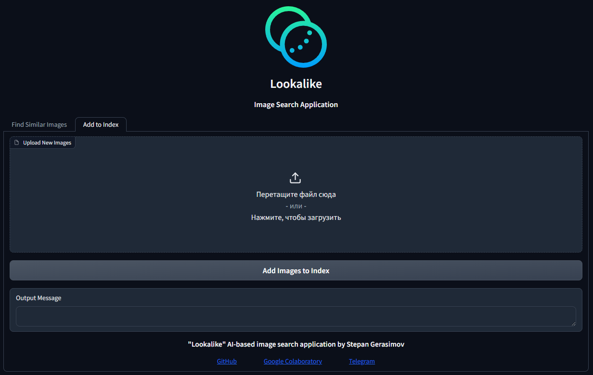
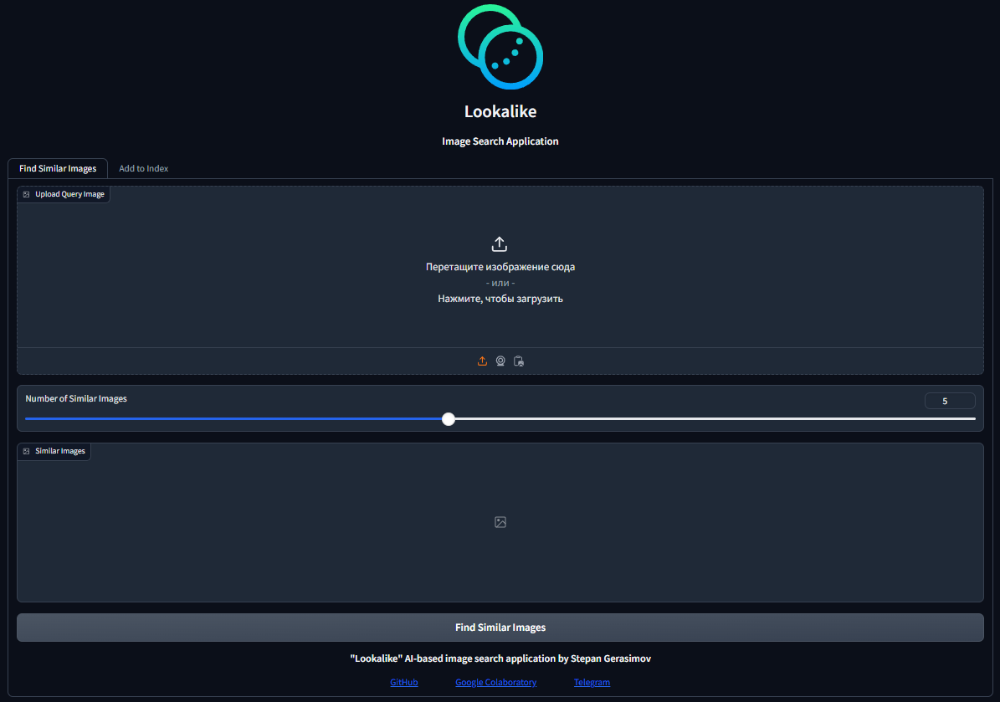
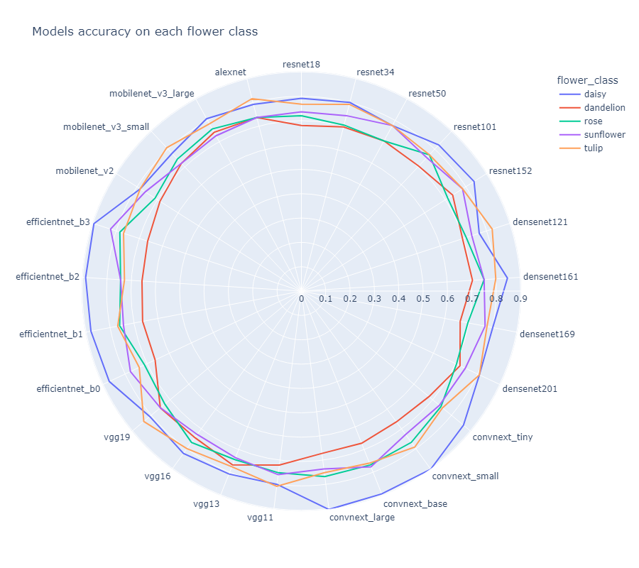
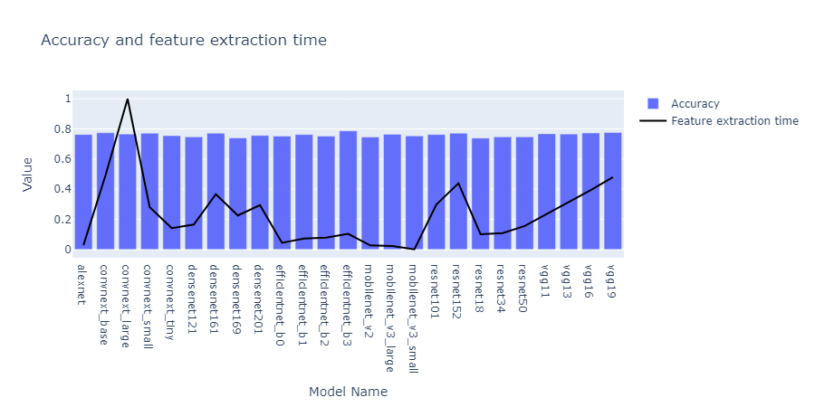

<p align="center">
  <a href="" rel="noopener">
 </a>
</p>

<h3 align="center">Lookalike</h3>

<div align="center">

[](/LICENSE)

</div>
<p align="center"> Проект посвящён исследованию методов обнаружения похожих изображений, а также разработке приложения, основанного на CNN.
    <br> 
</p>

## 📝 Оглавление

- [О проекте](#about)
- [Начало работы](#getting_started)
- [Использование](#usage)
- [Создано с помощью](#built_using)
- [Набор технологий](#technologies)
- [Автор](#author)
- [Благодарности](#acknowledgement)

## 🧐 Задачи проекта <a name = "#about"></a>

- Разработка приложения, основанного на CNN.
- Анализ существующих решений в области распознавания похожих изображений
- Тестирование различных CNN
- Деплой на Hugging Face

## 🏁 Начало работы  <a name = "getting_started"></a>

Благодаря инструкциям ниже, вы сможете запустить приложение локально.

### Установка

Само собой, необходимо скопировать репозиторий

```
git clone https://github.com/ninjagraph2/lookalike.git
```

При первом запуске запускаем файл: run_install_reqs.bat
Скрипт установит все необходимые зависимости в виртуальной среде, если они отстутствуют на ПК

После сообщения в консоли можно пользоваться приложением:
```
Running on local URL:  http://127.0.0.1:7860
```
Достаточно перейти по ссылке.

При всех последующих запусках пользуйтесь только run.bat!!!
Альтернатива (прежде всего, у вас должны быть установлены необходимые библиотеки).
Вы можете запустить приложение через терминал, находясь в директории командой:
```
gradio app.py
```

## 🎈 Использование <a name="usage"></a>

При использовании необходимо перейти в приложении на вкладку "Add to index" и загрузить интересующую Вас коллекцию изображений.

</a>

Далее, переходим на первую вкладку "Find Similar Images" и загружаем изображение, для которого хотим найти похожие, а также указываем их количество.
После нажатия кнопки "Find Similar Images", в галерее Similar Images появятся похожие на входное изображения.

</a>

## ⛏️ Создано с помощью <a name = "built_using"></a>

- [HuggingFaceSpace](https://huggingface.co/spaces/Stepan3745/lookalike-search) - Deployment
- [Gradio](https://www.gradio.app/) - UI
- [Mobilenet v3 small](https://pytorch.org/vision/main/models/generated/torchvision.models.mobilenet_v3_small.html) - Torchvision model
- [KD-Trees](https://scikit-learn.org/stable/modules/generated/sklearn.neighbors.KDTree.html) - Nearest Neighbours Method

Схема работы приложения:
1. Загрузка множества изображений в разделе Add To Index;
2. Извлечение из них фич с помощью CNN;
3. Загрузка в общий .pkl поисковой индекс;
4. На вход приложению в разделе Find Similar Images подаётся одно изображение;
5. Извлечение из него фич с помощью CNN;
6. Чтение pkl файла;
7. Сравнение фич индекса с фичами входного изображения методом KD-Trees;
8. Вывод необходимого кол-ва "соседей" для входного изображение.

По завершении работы приложения, очищается Temporary Storage с изображениями, а также очищается Search Index

## 👨‍💻 Библиотеки <a name = "technologies"></a>

- os
- numpy
- torch
- torchvision.transforms
- gradio
- pickle
- tempfile
- shutil

## 🔎 Исследование <a name = "research"></a>

Более подробное исследование, посвящённое 25 моделям из torch.models на [датасете с цветами](https://www.kaggle.com/datasets/alxmamaev/flowers-recognition) представлено в [Google Colab](https://drive.google.com/file/d/16TNOlIdlVJRI7WDkkhcol1CI4rDZiCHA/view?usp=sharing)

</a>

</a>

## ✍️ Автор <a name = "author"></a>

- [Степан Герасимов](https://t.me/ninjaaaaa999)

## 🎉 Благодарности <a name = "acknowledgement"></a>

Выражаю благодарность Университету Иннополиса, преподавателю курса Азату Якупову и наставнику курса Сергею Аверину.
